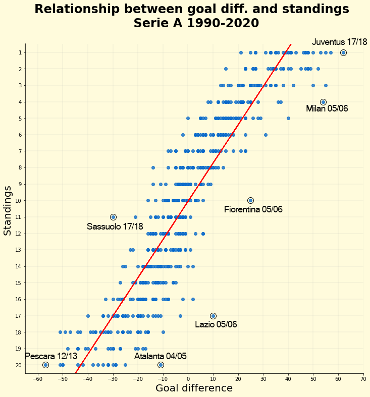
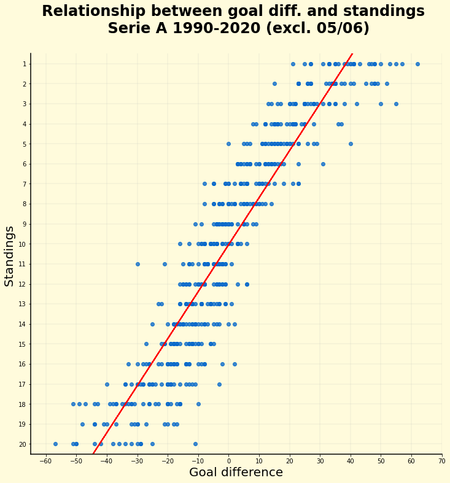

# Serie A standings prediction using linear regression

A model is created to predict the final league rank of a based on goal difference.  
The data was acquired from [WorldFootball](https://www.worldfootball.net/schedule/ita-serie-a-2019-2020-spieltag/38/) using the pandas Python library.

 
### First image
R-Squared = 0.840
Regression equation = y = 10.06 + -0.2323 * x

### Second image
R-Squared = 0.852
Regression equation = y = 10.04 + -0.2348 * x

